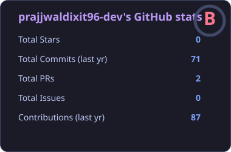
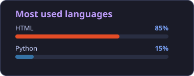
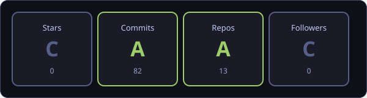

<div align="center">

# 👋 Hi, I'm Prajjwal Dixit

### 💻 Full Stack Web Developer | Python & Django


<p>
<a href="https://prajjwaldixit96-dev.github.io/prajjwaldixit96-dev/"></a>
<a href="https://www.linkedin.com/in/prajjwal-dixit/"></a>
<a href="mailto:prajjwaldixit96@gmail.com"></a>
</p>

</div>

---

## 👨‍💻 About Me

I’m a Full Stack Web Developer specializing in Python, Django and modern web technologies, with hands-on experience building responsive, secure and database-driven applications.

- 🚀 Developing full-stack web applications from frontend to backend
- 🐍 Building backend systems and REST APIs using Python, Django & Django REST Framework
- ⚛️ Working with modern frontend technologies including React, Next.js, JavaScript, HTML5, CSS3 & Bootstrap
- 🗄️ Experienced with MySQL & SQLite and database-driven application development
- 🔐 Implementing Authentication, CRUD Operations, Role-Based Access Control & secure data handling
- 🔗 Integrating third-party services and APIs such as Razorpay, Groq API & SMTP
- 🛠️ Using Git, GitHub, VS Code & Render across development and deployment workflows
- 💡 Focused on writing clean, maintainable code and building practical, scalable real-world applications

---

## 💼 Work Experience

### Web Development Intern — Techpile Technology Pvt. Ltd.
**Jan 2026 – Apr 2026 · On-site, Lucknow**

- Completed a 90-day Industrial Training in Web Development using Python & Django
- Executed frontend and backend development tasks to enhance application functionality
- Implemented CRUD operations, authentication, and database integration for seamless user experiences
- Gained hands-on experience in real-world project development, contributing to project success
- Adhered to industry coding practices while maintaining a structured development workflow

**Tech used:** `Python` `Django` `Bootstrap 5` `HTML5` `CSS3` `JavaScript` `MySQL` `SQLite` `Git` `GitHub`

---

## 🎓 Education

| Year | Degree | Institute |
|------|--------|-----------|
| 2024 – 2026 | Master in Computer Applications (MCA) | Babu Banarsi Das University (BBDU) |
| 2021 – 2024 | Bachelor of Computer Applications (BCA) | Public College of Professional Studies |

---

# 🛠️ Tech Stack

### 💻 Programming Languages

<p align="left">


</p>

### 🌐 Frontend

<p align="left">


</p>

### ⚙️ Frameworks & Libraries

<p align="left">


</p>

### 🗄️ Databases

<p align="left">


</p>

### 🔧 Tools & Platforms

<p align="left">


</p>

### 🔌 APIs & Integrations

<p align="left">


</p>

### 🗣️ Languages I Speak

<p align="left">


</p>

---

# 🚀 Featured Projects

## 🔐 Zero Knowledge File Sharing Vault

Developed a secure file sharing web application using Django, implementing a **Zero-Knowledge Security Model**. Features include client-side AES encryption, secure upload/download, protected sharing links, user authentication, and role-based access control — ensuring complete data privacy and secure data management.

**Tech:** `Python` `Django 5` `SQLite` `AES-256 Encryption` `Fernet Encryption` `REST API` `Session Auth` `HTML5` `CSS3` `JavaScript` `SMTP Email`

---

## 🤖 Alfred — Personal AI Assistant Chatbot

Developed a conversational AI chatbot utilizing the **Groq LLM API**, featuring a custom prompt and persistent conversation history. The assistant maintains context across the last 10 messages, responds in Hinglish, and facilitates tasks such as coding assistance, research, scheduling, and emotional support. Built with a Django backend and a dynamic frontend interface.

**Tech:** `Python` `Django 5.2` `Groq API (LLaMA 3.3 70B)` `SQLite` `REST API (JSON)` `python-dotenv` `Vanilla JavaScript (Fetch API)` `HTML5` `CSS3`

---

## 🛒 E-Commerce Platform

Developed a full-stack e-commerce web application featuring product listings, shopping cart, order management, and an admin dashboard. Implemented user authentication, order status tracking, and a modular Django app structure with dedicated modules for accounts, cart, orders, and store management.

**Tech:** `Python` `Django 5.2` `MySQL` `Razorpay Payment Gateway` `Pillow` `WhiteNoise` `Gunicorn` `python-dotenv` `Bootstrap 5` `HTML5` `CSS3` `JavaScript`

---

# 🎮 Developer Space Shooter

<div align="center">



<br>

### ⚡ AUTO-RUNNING • SHOOT • DESTROY • SURVIVE

</div>

---

# 📊 GitHub Statistics

<div align="center">




</div>

---

# 🔥 GitHub Contribution Streak

<div align="center">


</div>

---

# 📈 Contribution Activity

<div align="center">


</div>

---

# 🏆 GitHub Trophies

<div align="center">



</div>

---

# 🎯 Current Focus

<div align="center">

```text
🐍 Python
🌐 Django
🔗 REST APIs
🗄️ MySQL / SQLite
⚡ JavaScript
🧠 Data Structures & Algorithms
🚀 Full Stack Development
```

</div>
